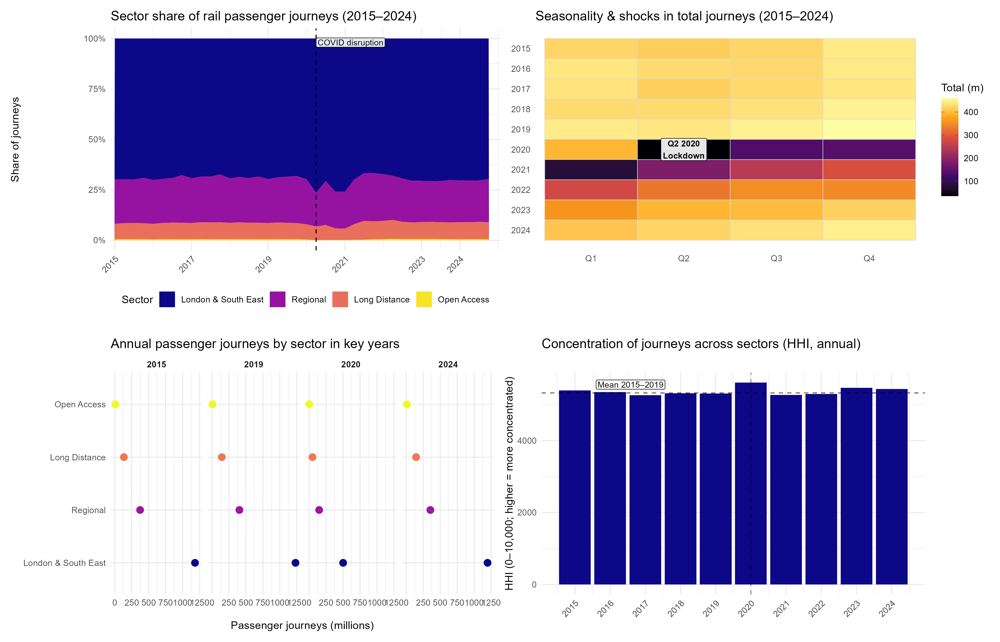

# IJC445-rail-journeys-visualisations
Composite visualisation project analysing UK rail passenger journeys (2015–2024), focusing on sector composition, seasonality, key-year magnitudes, and market concentration using ORR data.
# IJC445 — UK rail passenger journeys (2015–2024)

This project explores how UK rail passenger journeys changed from 2015–2024, focusing on: (1) how totals vary by year/quarter (seasonality + COVID-19 shock), (2) how journeys are distributed across sectors, and (3) whether concentration across sectors increased during disruption and recovery. Key message: demand collapses sharply in 2020 (especially Q2), sector dominance remains stable, and concentration temporarily increases around the disruption.

**Key findings**
- Heatmap: Clear seasonality and a structural break in **Q2 2020**.
- Sector shares: London & South East remains dominant; shares shift temporarily during COVID disruption.
- Key years: 2020 shows major volume decline; 2024 indicates recovery relative to 2020.
- HHI: Concentration rises around 2020 then moves back toward pre-disruption levels.
